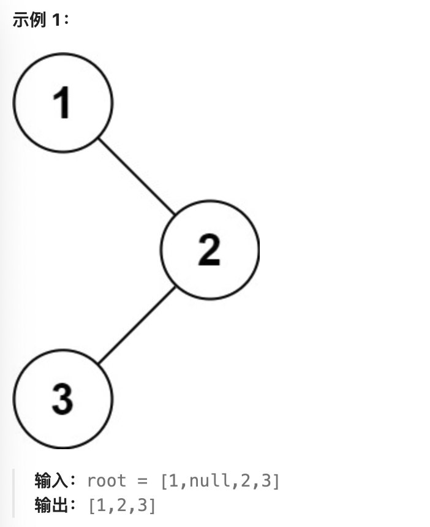
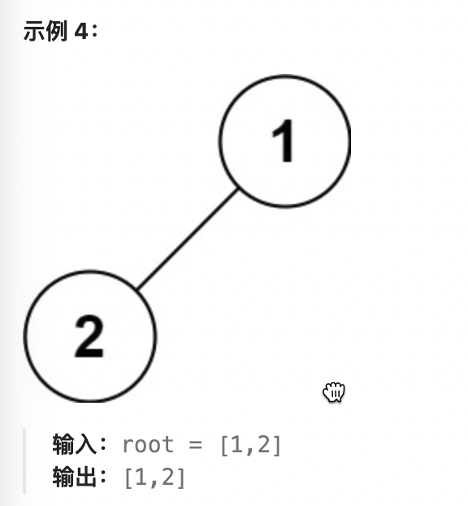

144. 二叉树的前序遍历

给你二叉树的根节点 root ，返回它节点值的 前序 遍历。

示例 1：

输入：root = [1,null,2,3]
输出：[1,2,3]

示例 2：

输入：root = []
输出：[]

示例 3：

输入：root = [1]
输出：[1]

示例 4：

输入：root = [1,2]
输出：[1,2]

示例 5：

输入：root = [1,null,2]
输出：[1,2]
 

提示：

树中节点数目在范围 [0, 100] 内
-100 <= Node.val <= 100